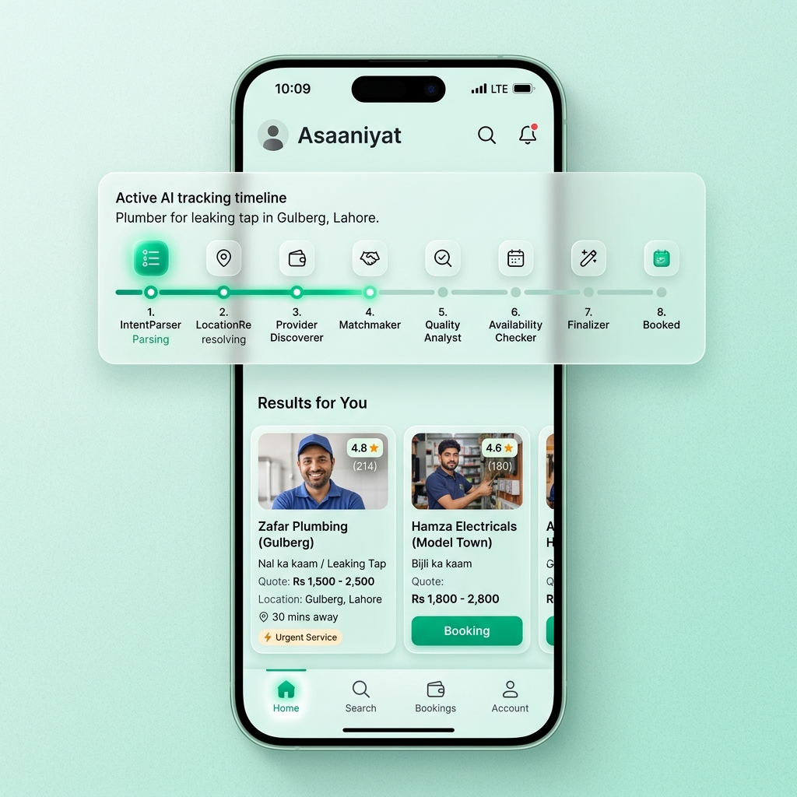
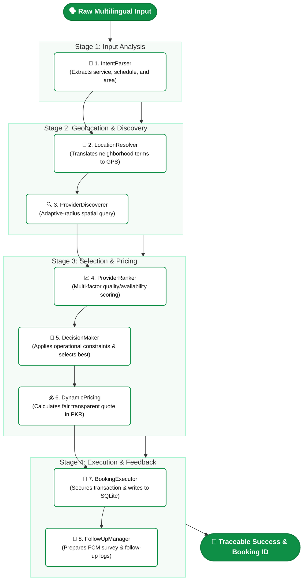

# 🌿 Asaaniyat (عسانیت)

<p align="center">
  
</p>

<p align="center">
  
</p>

<p align="center">
  
  
  
  
  
</p>

---

## 🌟 Vision & Overview

**Asaaniyat** is an agentic, mobile-first AI orchestrator designed specifically to empower and organize the informal economy (electricians, plumbers, AC technicians, carpenters, painters, and handymen) across Pakistan.

By leveraging a robust **8-Agent AI Pipeline**, users can state their maintenance and service requests naturally in **Urdu, Roman Urdu, or English**. The system completely automates the service cycle: parsing intent, resolving geospatial coordinates, filtering & ranking providers, determining transparent costs, committing secure transactions, and simulating feedback notifications—all completed within seconds.

---

## 🚀 Key Features

* **🗣️ Multilingual Voice & Text Parsing**: Native support for English, standard Urdu, and Roman Urdu dialect inputs.
* **🤖 Decoupled 8-Agent Pipeline**: Specialized agents executing sequentially over a centralized state manager, providing total transparency and trace logs.
* **🌿 Light Mint Glassmorphism UI**: Beautiful, premium, native-feeling mobile components with smooth micro-animations and real-time trace timelines.
* **🛡️ RAG-Augmented Provider Chat**: A secure user-to-provider messaging module utilizing Retrieval-Augmented Generation for contextual inquiries.
* **📊 Comprehensive Admin Panel**: Web-based operations dashboard with visual KPI trackers, analytical charts, and automated conflict-simulation triggers.

---

## 🤖 The 8-Agent Orchestration Flow

The execution cycle of any service request is handled transparently by the following specialized agents:



| Sequence | Agent Name | Primary Responsibility | Input → Output |
| :---: | :--- | :--- | :--- |
| **1** | `IntentParser` | Deciphers raw user query to extract primary service type, preferred schedule, and area. | *Raw Input Text* → `Parsed Intent` |
| **2** | `LocationResolver` | Maps natural neighborhood terms (e.g., "F-8 Markaz") into high-precision GPS coordinates. | *Area Name String* → `Latitude/Longitude` |
| **3** | `ProviderDiscoverer`| Performs spatial searches in the provider database within an adaptive geographical radius. | *Service + Coordinates* → `Provider Base List` |
| **4** | `ProviderRanker` | Calculates multi-factor quality scores (distance, historical ratings, availability). | `Provider Base List` → `Scored Rankings` |
| **5** | `DecisionMaker` | Applies hard operational business constraints to elect the single best matching professional. | `Scored Rankings` → `Target Selected Provider` |
| **6** | `DynamicPricing` | Estimates a fair, transparent cost adjusted for distance complexity and task details. | `Selected Provider` → `PKR Quotation` |
| **7** | `BookingExecutor` | Generates secure transactions, logs analytical tokens, and registers the booking. | `PKR Quotation` → `Unique Booking ID` |
| **8** | `FollowUpManager` | Prepares automated reminders and scheduling hooks for feedback surveys via FCM. | `Unique Booking ID` → `FCM Triggers` |

---

## 🛠️ Local Development & Quick Start

To run the entire ecosystem locally, open separate terminal shells for each service:

### 1. Backend Engine (Node.js API)
```bash
cd backend
npm install
npm run dev
```
> [!NOTE]
> Copy `backend/.env.example` to `backend/.env` and supply your `GEMINI_API_KEY` or `GROQ_API_KEY` for live agentic chat. Otherwise, the app gracefully boots in zero-config **Demo Mode** using local fallback rules.

### 2. Mobile Frontend (React Native & Expo)
```bash
cd mobile
npm install
npx expo start
```
> [!TIP]
> Scan the QR code with your phone (iOS Camera or Expo Go App for Android). Ensure both devices share the same local Wi-Fi to establish real-time connections automatically.

### 3. Operations Panel (Admin Dashboard)
```bash
cd "admin dashboard"
npm install
npm run dev
```
> Navigate to [http://localhost:5173](http://localhost:5173) in your web browser. Create an account to gain administrative metrics, charts, and tracing tables.

---

## 📡 Essential Core API Endpoints

The server defaults to port `3001` and supports the following endpoints:

* **`POST /api/service-request`**: Standard entry point executing the entire 8-Agent Pipeline.
* **`POST /api/chat/message`**: Feeds text queries directly into the localized RAG retrieval context.
* **`POST /api/chaos/simulate`**: Mimics structural cancellations to demonstrate provider re-routing mechanics.
* **`GET /api/booking/:id`**: Returns deep database properties for any active booking.
* **`GET /api/logs`**: Exposes JSON metrics containing trace history records of pipeline executions.

---

## 📂 Repository Blueprint

```text
Asaaniyat/
├── backend/                  # Express APIs, SQLite Engine, and Antigravity orchestrators
│   ├── agents/               # Structural Agent classes
│   ├── orchestrator/         # Shared state context and pipeline sequencer
│   ├── rag/                  # RAG context and data store
│   └── server.js             # Entry Express configuration
├── mobile/                   # React Native & Expo SDK 54 mobile application
│   ├── screens/              # UI pages (Tracing, Results, Search, Booking Confirmation)
│   ├── assets/               # Branding icons and loading files
│   └── theme.js              # Palette configuration for Light Mint Glassmorphism
├── admin dashboard/          # React & Vite Administration Panel
│   ├── src/pages/            # Dashboard Analytics, Bookings, Users management
│   └── src/App.css           # Custom Glassmorphism styles
├── docs/                     # Visual assets, testing diagrams, and walkthroughs
└── tests/                    # Analytical tests validating orchestrator execution
```

---

## 📖 In-Depth Sub-Documentation

Explore the specific areas of the platform through our dedicated documentation sheets:

* 🏗️ **[System Architecture (ARCHITECTURE.md)](./ARCHITECTURE.md)** — Core backend pipelines, shared state context, and databases.
* 🎨 **[UI/UX Design Language (DESIGN.md)](./DESIGN.md)** — "Light Mint Glassmorphism" specifications, color tokens, and layout guidelines.
* 📊 **[Admin Dashboard Operations (admin dashboard/README.md)](./admin%20dashboard/README.md)** — KPI structures, API lists, and management setup.
* 🧪 **[Quality Assurance & Testing (QA.md)](./QA.md)** — Test scenarios, automated check lists, and pipeline assertions.
* ☁️ **[Deployment Runbook (DEPLOYMENT.md)](./DEPLOYMENT.md)** — Cloud Run steps and Expo EAS compilation structures.

---

<div align="center">
  <p>Built with ❤️ for the <b>Google Antigravity Hackathon</b></p>
</div>
