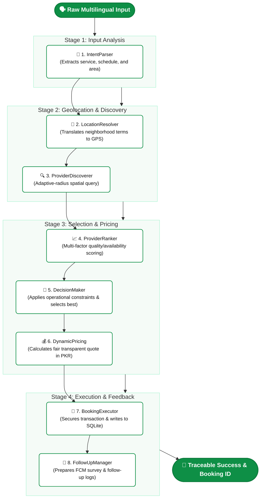

# ⚙️ Asaaniyat Backend & Agent Engine

<p align="left">
  
  
  
  
</p>

The core intelligence and orchestration center of the **Asaaniyat** ecosystem. It hosts the backend REST API and the **Antigravity 8-Agent AI Pipeline** that powers natural language service discovery, provider matching, dynamic pricing, and booking orchestration.

---

## 🧠 Architectural Overview

At the heart of the engine is the `AntigravityOrchestrator`, which manages 8 highly decoupled, specialized agents. Instead of direct calling or cascading state, they communicate via a centralized, immutable `Context` state engine.



---

## 🚀 Quick Start (Local Setup)

### 1. Install Dependencies
Run from the `/backend` folder:
```bash
npm install
```

### 2. Configure Environment Variables
Copy `.env.example` to `.env` to unlock live LLM reasoning, fallback routes, and provider chats:
```bash
cp .env.example .env
```
Fill in your API credentials:
```env
PORT=3001
GROQ_API_KEY=your_groq_api_key
GEMINI_API_KEY=your_gemini_api_key
```

> [!NOTE]
> **Zero-Config Demo Mode**: 
> If no API keys are provided in `.env`, the orchestrator automatically runs in **Demo Mode**. It uses advanced local deterministic intent parsing and coordinate matching to demonstrate the full 8-agent trace without external network requests!

### 3. Launch Development Server
```bash
npm run dev
```
The backend API is now running and live at [http://localhost:3001](http://localhost:3001).

---

## 📡 API Routing Cheat-Sheet

All application routes are structured under `/api/*`:

* **`POST /api/service-request`**: Orchestrates the 8-Agent pipeline. Receives `{ requestText, lat, lng }`.
* **`POST /api/chat/message`**: Handles contextual, grounded service inquiries using localized RAG context.
* **`POST /api/chaos/simulate`**: Triggers real-time cancellation simulations to demonstrate agent-driven re-routing.
* **`GET /api/logs`**: Retrieves details of the structured agent traces.

---

> [!TIP]
> **Auditing Traces**:
> You can view exact timing metrics, agent inputs, and reasoning paths in real-time. Look in `backend/logs/` or hit the `/api/logs` endpoint directly to fetch JSON metrics.

---

<div align="center">
  <p>Built with precision for the <b>Google Antigravity Hackathon</b></p>
</div>
