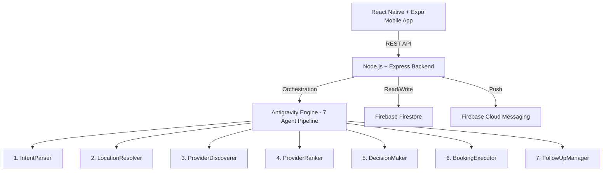

# AI Service Orchestrator — Implementation Plan

## Overview

Build a mobile-first agentic AI application for Pakistan's informal service economy per the briefing document. Users describe needs in Urdu/Roman Urdu/English → 7-agent pipeline parses, finds, ranks, books providers → Firestore persistence → push notification reminders.

## Architecture

## Proposed Changes

### Phase 1: Project Foundation

#### [NEW] Backend Skeleton

- `backend/package.json` — Node.js project with Express, Firebase Admin SDK, cors, dotenv, express-rate-limit
- `backend/server.js` — Express server with rate limiting, CORS, input sanitization middleware
- `backend/.env.example` — Template for Firebase credentials, port config
- `backend/middleware/sanitize.js` — Input sanitization (trim, 500 char limit, strip HTML/control chars)
- `backend/middleware/rateLimit.js` — 100 req/15min per IP

#### [NEW] Firebase Config

- `backend/config/firebase.js` — Firebase Admin SDK initialization
- `firestore.rules` — Security rules per Section 11

---

### Phase 2: Data Layer

#### [NEW] Mock Provider Dataset

- `backend/data/providers.json` — 60 mock providers across Islamabad (G-6 to G-15, F-6 to F-11, I-8, I-9), Lahore (DHA, Gulberg, Johar Town, Model Town), Karachi (Clifton, Defence, Saddar, PECHS, Gulshan). Services: AC, Electrician, Plumber, Carpenter, Painter, Handyman.

#### [NEW] Coordinate Cache

- `backend/data/coordinates.json` — Hardcoded lat/lng for all supported areas across 3 cities

#### [NEW] Keyword Dictionaries

- `backend/data/keywords.json` — Service type keywords (Urdu, Roman Urdu, English), time expressions, location patterns

---

### Phase 3: 7-Agent Pipeline

#### [NEW] Agent Base Class

- `backend/agents/BaseAgent.js` — Abstract base with `execute(context)`, logging, timing, error handling

#### [NEW] Agent 1 — IntentParser

- `backend/agents/IntentParserAgent.js` — Regex + keyword matching for service type, location, time preference. Supports Roman Urdu (chahiye, zaroorat), Urdu script, English. Outputs confidence score.

#### [NEW] Agent 2 — LocationResolver

- `backend/agents/LocationResolverAgent.js` — Local coordinate cache lookup. Validates Pakistan bounding box (lat: 23.0–37.5, lng: 60.0–77.5). Falls back to "ask user" if not found.

#### [NEW] Agent 3 — ProviderDiscoverer

- `backend/agents/ProviderDiscovererAgent.js` — Filters mock providers by service type + area within 5km. Expands to 10km if none found.

#### [NEW] Agent 4 — ProviderRanker

- `backend/agents/ProviderRankerAgent.js` — Scoring: `score = (distance × 0.30) + (rating × 0.30) + (availability × 0.20) + (response_time × 0.20)`. Normalizes each factor to 0–1. Validates scores. Sorts descending.

#### [NEW] Agent 5 — DecisionMaker

- `backend/agents/DecisionMakerAgent.js` — Hard constraint checks (verified, available slots, distance ≤ 5km, confidence > 0.5). Selects top provider. Generates reasoning text. Lists alternatives.

#### [NEW] Agent 6 — BookingExecutor

- `backend/agents/BookingExecutorAgent.js` — Writes booking to Firestore. Generates booking ID (`BK_{timestamp}`). Selects first available slot in time window. Retry 3× with backoff on failure.

#### [NEW] Agent 7 — FollowUpManager

- `backend/agents/FollowUpManagerAgent.js` — Schedules 3 notifications (1hr before push, 30min before SMS, next-day feedback). Writes to Firestore notifications collection.

---

### Phase 4: Orchestration Engine

#### [NEW] Antigravity Orchestrator

- `backend/orchestrator/AntigravityOrchestrator.js` — Central orchestrator that manages shared context object, sequences 7 agents, maintains execution trace, handles timeouts (10s max), retry on failure, graceful fallback mode.

#### [NEW] API Routes

- `backend/routes/serviceRoutes.js` — 
  - `POST /api/service-request` — Main endpoint, runs full pipeline
  - `POST /api/booking/confirm` — Confirm a booking
  - `GET /api/booking/:booking_id` — Get booking details
  - `POST /api/booking/:booking_id/feedback` — Submit feedback

---

### Phase 5: React Native Mobile App

#### [NEW] Expo Project

- `mobile/` — Expo project with React Navigation, Axios

#### [NEW] 7 Screens (per Section 10)

1. `mobile/screens/HomeScreen.js` — Large text input + quick-select service buttons (AC, Electrician, Plumber, Carpenter). Send button.
2. `mobile/screens/IntentConfirmScreen.js` — Parsed intent display (Service, Location, Time, Confidence %). Warning if confidence < 0.7. Confirm/Edit buttons.
3. `mobile/screens/LoadingScreen.js` — Animated pipeline steps (Searching → Ranking → Deciding → Done). Real progress from backend.
4. `mobile/screens/ProviderResultsScreen.js` — Top 3 providers with scores, distance, rating, availability. #1 has "Recommended" badge.
5. `mobile/screens/BookingConfirmScreen.js` — Selected provider details, time slot, confirm/cancel.
6. `mobile/screens/ConfirmationScreen.js` — Success: booking ID, provider contact, reminders. "View Agent Trace" button.
7. `mobile/screens/AgentTraceScreen.js` — Scrollable 7-agent log with timing, I/O, reasoning. Export as JSON.

#### [NEW] Design System

- Premium dark mode with glassmorphism
- Pakistan green (#01411C) accent
- Smooth animations and micro-interactions
- Google Fonts (Inter/Outfit)

---

### Phase 6: Polish & Submission

- Error handling for all edge cases
- README.md with architecture, setup instructions, Antigravity usage
- Agent trace JSON export (`agent_traces.json`)
- .gitignore (no secrets)

## Build Order

| Step | Component | Estimated Time |
|------|-----------|---------------|
| 1 | Backend skeleton + Express server | 30 min |
| 2 | Mock data (providers, coordinates, keywords) | 45 min |
| 3 | 7 Agent classes | 2 hrs |
| 4 | Orchestrator + API routes | 1 hr |
| 5 | Backend testing end-to-end | 30 min |
| 6 | Expo mobile app init | 20 min |
| 7 | 7 screens with navigation | 3 hrs |
| 8 | UI polish + animations | 1 hr |
| 9 | README + submission artifacts | 30 min |

## Verification Plan

### Automated Tests
- `curl` test all 4 API endpoints with sample Pakistani inputs
- Verify Firestore writes (or mock in demo mode)
- Test Roman Urdu, Urdu script, and English inputs
- Test edge cases: unknown location, unknown service, low confidence

### Manual Verification
- Run Expo app on device/simulator
- Full flow: type request → confirm → view results → book → see trace
- Test the exact demo script from Section 10: "Electrician chahiye G-11 mein kal subah"

> [!IMPORTANT]
> The briefing mentions "Google Antigravity" as the orchestration SDK. Since this is a hackathon concept, I'll implement the orchestrator as a custom class that mimics the Antigravity API surface described in the document (workflow definition, `run()` method, trace emission). This gives us the exact same demo output and architecture without depending on an SDK that may not be publicly available.

> [!NOTE]
> Firebase will run in a "demo mode" — the backend will simulate Firestore writes and FCM notifications using in-memory storage, with the option to connect real Firebase credentials via .env. This ensures the app works immediately without Firebase setup.
