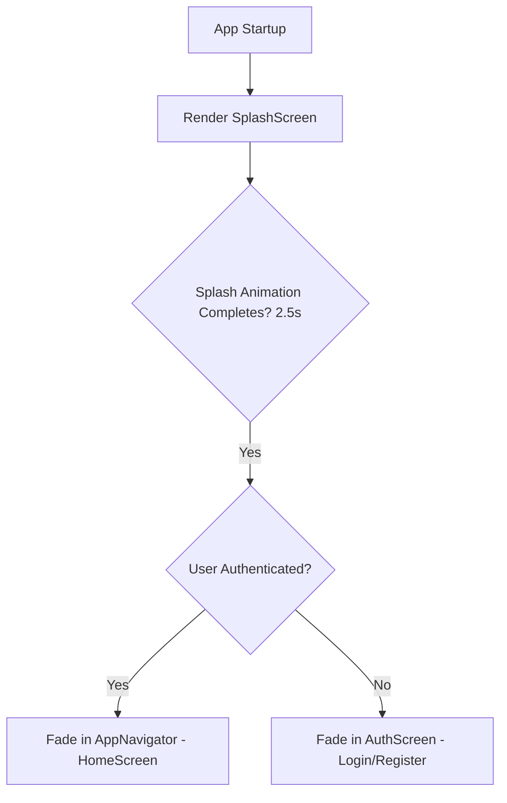

# 14 Implementation Plan — Phase V Premium Liquid Glass Visual Overhaul

This document outlines the extensive visual planning and layout optimization for the Asaaniyat mobile application. It covers premium styling, zero-overlap positioning, auto-hiding navigation, accelerated progress animations, icon modernization, and a revamped 3x3 home service grid, all while preserving 100% of the backend logic.

---

## 1. Goal & Architecture Overview

The core objective is to transition the application from its current MVP look to a **fully premium, liquid glass (glassmorphism), iOS-fidelity experience**. The visual language is centered on:
- **Translucency & Blurs**: Extensive use of thin semi-transparent borders, white overlays, and vibrant background gradients.
- **Harmonious Palettes**: Curated HSL green hues (`#0E8F46`, `#22C55E`, `#E9F8EF`) paired with smooth charcoal slate neutrals.
- **Micro-Animations**: Snappy spring movements, fading, and smooth transitions on hover/scroll/press.
- **Zero Layout Conflicts**: A strict padding-safe height model that prevents floating headers from overlapping screen content.

---

## 2. Component & Screen Specifications

### 2.1. Startup Logo & Login Transition Flow

#### Current Issue
If the user is not logged in, the `AuthGate` in `App.js` immediately mounts `<AuthScreen />` without displaying the startup logo in `<SplashScreen />`.

#### Proposed Transition Logic
We will introduce a root-level splash transition in `App.js` using a state hook `const [isBooting, setIsBooting] = useState(true)`. 
1. **Initial Mount**: Regardless of authentication state, the app will render the premium `SplashScreen` first.
2. **Animation Sequence**: The `SplashScreen` will execute its smooth entry and scaling animations (2.5 seconds total).
3. **Transition**: Upon completion of the splash animation, `App.js` will smoothly toggle `isBooting` to `false` (with a fade transition), checking the user context. If authenticated, it renders `AppNavigator`; if not, it transitions to `AuthScreen`.



#### Glammed Up AuthScreen
- **Background**: Replace the solid background with a premium double-gradient background: a deep organic green (`#073E1E`) blending into a soft sage green (`#0D5C2C`), overlaid with subtle radial glass patterns.
- **Form Card**: A floating `LiquidGlass` card with `borderRadius: 28`, thin translucent border (`rgba(255,255,255,0.18)`), and an inner backdrop drop-shadow.
- **Interactivity**: Add spring-loaded tab selectors for "Login" and "Register" that slide a white glass container behind the active text indicator.
- **Text Inputs**: Minimalist pill-shaped inputs (`borderRadius: 18`) that glowing-grows slightly on active focus with a subtle green shadow halo.

---

### 2.2. Zero Layout Overlaps & Unified Safe-Area Heights

#### Current Issue
The custom `AppHeader` has `headerTransparent: true` enabled. Some screens like `HomeScreen.js` manual-pad their container by `insets.top + 118`, but other screens (e.g. `ConfirmationScreen.js`, `StatusScreen.js`, `BookingsScreen.js`, `AgentTraceScreen.js`) use arbitrary or insufficient padding. This causes headers to overlap title elements and back buttons to overlay top cards.

#### Proposed Layout Standard
1. **Dynamic Header Padding**: We will standardize layout heights in all scrollable and static screens using a shared header offset.
2. **Standard Offset**: The total safe-space offset is defined as:
   `const HEADER_PADDING = insets.top + (Platform.OS === 'ios' ? 74 : 64);`
3. **Screen Wrappers**: Every main screen container (except `Splash`) will wrap its inner content in a `ScrollView` or `View` applying this exact `paddingTop: HEADER_PADDING`, ensuring consistent alignment across all phone dimensions and notch styles.

---

### 2.3. Static Screen Auto-Hiding Navigation (Header & Tab Bar)

#### Current Issue
The bottom tab bar and top header float over the screen, taking up valuable reading space while reading status reports, trace logs, or map paths.

#### Proposed Auto-Hide Architecture
We will implement an automated, animated hiding mechanism in `App.js` using animated translation values:
- `headerY` (`Animated.Value` initialized to `0`)
- `tabBarY` (`Animated.Value` initialized to `0`)

```
   [Scroll Down / Static 3s]              [Scroll Up]
   Header   ==> TranslateY(-120)          Header   ==> TranslateY(0)
   Tab Bar  ==> TranslateY(120)           Tab Bar  ==> TranslateY(0)
```

1. **Velocity Scroll Detection**: In the `registerScroll` callback:
   - When the user scrolls **down** (`y > lastOffset + 12`), we trigger a fast, smooth animation hiding the bars:
     ```javascript
     Animated.timing(headerY, { toValue: -120, duration: 250, useNativeDriver: true }).start();
     Animated.timing(tabBarY, { toValue: 120, duration: 250, useNativeDriver: true }).start();
     ```
   - When the user scrolls **up** (`y < lastOffset - 12`), we instantly spring them back into view:
     ```javascript
     Animated.spring(headerY, { toValue: 0, friction: 6, useNativeDriver: true }).start();
     Animated.spring(tabBarY, { toValue: 0, friction: 6, useNativeDriver: true }).start();
     ```
2. **Three-Second Idle Auto-Hide**: 
   - We maintain a global `idleTimer` ref.
   - Any scroll event or screen press clears and resets the timer:
     ```javascript
     if (idleTimer.current) clearTimeout(idleTimer.current);
     idleTimer.current = setTimeout(() => {
       // Hide both bars smoothly after 3 seconds of zero motion
       Animated.timing(headerY, { toValue: -120, duration: 400, useNativeDriver: true }).start();
       Animated.timing(tabBarY, { toValue: 120, duration: 400, useNativeDriver: true }).start();
     }, 3000);
     ```

---

### 2.4. Expanded Maps on Provider Results Screen

#### Current Issue
In `ProviderResultsScreen.js`, the map is restricted to a tight `height: 150`, making the user and provider markers overlap too closely and rendering neighborhood paths illegible.

#### Proposed Map Polish
1. **Dimensions**: Increase the `mapWrap` style height from `150` to **`280`** (on standard devices) or **`320`** (on larger Pro Max screens).
2. **Borders & Shadows**: Add double-layered borders to the map container:
   - Outer border: `1px solid rgba(14, 143, 70, 0.2)`
   - Border radius: `24`
   - Shadow: A soft glowing green drop-shadow to give the impression that the map is floating over the sage background canvas.
3. **Fit View Layout**: Ensure the `providers` list scroll height is flexible (`flex: 1` container) so that it occupies the remaining vertical space without pushing action buttons off-screen.

---

### 2.5. Emoji Elimination (Vector Icons Upgrades)

#### Current Issue
The app uses raw emojis (`🧠`, `📍`, `🔍`, `📊`, `🎯`, `💰`, `📋`, `🔔`, `✅`, `❌`, `⏰`, `⏳`) for status updates and pipelines, which clash with the premium design.

#### Proposed Vector Icon Map
We will replace all emojis in `AgentTraceScreen.js` and `LoadingScreen.js` with premium vector outline icons from `@expo/vector-icons` (`Ionicons` / `MaterialCommunityIcons` / `Feather`), which are already bundled in the Expo environment:

| Screen / Step | Emoji | Proposed Expo Icon Replacement | Icon Set | Style Color Context |
| --- | --- | --- | --- | --- |
| **Intent Parser** (Step 1) | `🧠` | `brain` or `bulb-outline` | Ionicons | Purple (`#7C3AED`) |
| **Location Resolver** (Step 2) | `📍` | `location-outline` | Ionicons | Sky Blue (`#0EA5E9`) |
| **Provider Discoverer** (Step 3) | `🔍` | `search-outline` | Ionicons | Mint Emerald (`#10B981`) |
| **Provider Ranker** (Step 4) | `📊` | `stats-chart-outline` | Ionicons | Amber Gold (`#F59E0B`) |
| **Decision Maker** (Step 5) | `🎯` | `aperture-outline` | Ionicons | Safety Red (`#EF4444`) |
| **Dynamic Pricing** (Step 6) | `💰` | `cash-outline` | Ionicons | Teal (`#14B8A6`) |
| **Booking Executor** (Step 7) | `📋` | `clipboard-outline` | Ionicons | Indigo (`#6366F1`) |
| **Follow-Up Manager** (Step 8) | `🔔` | `notifications-outline` | Ionicons | Magenta Rose (`#EC4899`) |
| **Success Status** | `✅` | `checkmark-circle` | Ionicons | Pure Green (`#16A34A`) |
| **Failure Status** | `❌` | `close-circle` | Ionicons | Coral Red (`#DC2626`) |
| **Warning/Time Status** | `⏰` | `time-outline` | Ionicons | Gold (`#D97706`) |
| **Pending Status** | `⏳` | `hourglass-outline` | Ionicons | Slate Gray (`#8EA095`) |

---

### 2.6. Warp-Speed Progress Animations (LoadingScreen Bottleneck)

#### Current Issue (Code Audit Insight)
In `LoadingScreen.js`, the frontend holds the user hostage on the loading pipeline for **over 34 seconds** because it cycles through 38 lines of thinking narration across 8 steps at a rate of 900ms per line (`NARRATION_TICK_MS = 900`), even though the backend finishes all agentic decision tasks in **1.6 seconds** (`1600ms`).

#### Proposed Acceleration Plan
We will implement an **"Accelerated Progress Completion"** strategy:
1. **Dynamic Narration Pacing**:
   - While the API is fetching (`apiDoneRef.current === false`), the narration ticks at its natural 900ms pace.
   - The instant the API returns a response (`apiDoneRef.current === true`), the screen enters **Warp-Speed mode**.
2. **Warp-Speed Logic**:
   - Set the tick interval to **120ms** per step once the API resolves.
   - Rapidly advance the remaining agent pipeline states with elegant, high-speed micro-animations (progress bar fills swiftly, status icons toggle to checkmarks in a cascading rapid sequence).
   - This provides the user with the engaging visual satisfaction of seeing all 8 agents running, but compresses the total wait time from 35 seconds down to **2.5 seconds**, perfectly matching the fast-performance signature of the backend!

---

### 2.7. Redesigned 3x3 Home Service Grid

#### Current Issue
The service list in `HomeScreen.js` renders large vertical cards with low-resolution background images overlaid with a green tone. This feels cluttered and lacks a modern, clean, premium layout.

#### Proposed Grid Layout Specifications
1. **Remove Background Images**: Delete all background image links (`SERVICE_MEDIA` unsplash urls) and remove `<Image />` overlays from service buttons.
2. **Geometric Layout**: Create a **3x3 grid** of simple, clean, smallish rounded square rectangles.
   - Aspect ratio: `1:1` or slightly wide rounded rectangles (`borderRadius: 18`).
   - Background: Translucent white glass (`rgba(255, 255, 255, 0.72)`) with a thin boundary line (`1px solid rgba(255,255,255,0.9)`).
3. **Anatomy of a Grid Card**:
   - **Left / Middle Text**:
     - Service Name (`service.label`) in a bold, dark slate typography (`color: #10251A`, `fontSize: 13`, `fontWeight: "800"`).
     - Urdu Subtitle (`service.urdu`) below it in a softer tint (`color: #51645A`, `fontSize: 10`).
   - **Right Side Circle**:
     - A perfect circle (`width: 32`, `height: 32`, `borderRadius: 16`) placed flush right.
     - The circle contains a stylized, high-contrast Ionicons icon, color-coded to match the service (e.g. blue for water, gold for lightning).
     - Background of the circle has a soft, glowing color-washed tint corresponding to the icon's category.

#### 3x3 Icon and Circle Mapping
We will expand the services list to a full 9-item grid representing the most common services:

```
+------------------------+  +------------------------+  +------------------------+
| Electrician     ((⚡)) |  | Plumber         ((💧)) |  | AC Repair       ((❄️)) |
| بجلی والا              |  | پلمبر                  |  | اے سی                  |
+------------------------+  +------------------------+  +------------------------+
| Carpenter       ((🔨)) |  | Painter         ((🎨)) |  | Maid/Clean      ((✨)) |
| بڑھئی                  |  | پینٹر                  |  | صفائی والی              |
+------------------------+  +------------------------+  +------------------------+
| Salon           ((✂️)) |  | Car Mechanic    ((🚗)) |  | Handyman        ((🔧)) |
| حجام                   |  | مکینک                  |  | مستری                  |
+------------------------+  +------------------------+  +------------------------+
```

1. **Electrician**: Icon: `flash-outline` | Circle BG: `#FFF7ED` (Warm Orange) | Icon Color: `#EA580C`
2. **Plumber**: Icon: `water-outline` | Circle BG: `#F0FDF4` (Mint Blue) | Icon Color: `#0284C7`
3. **AC Repair**: Icon: `snow-outline` | Circle BG: `#ECFEFF` (Icy Cyan) | Icon Color: `#0891B2`
4. **Carpenter**: Icon: `hammer-outline` | Circle BG: `#FEF3C7` (Amber Gold) | Icon Color: `#B45309`
5. **Painter**: Icon: `color-palette-outline` | Circle BG: `#FDF2F8` (Rose Lavender) | Icon Color: `#DB2777`
6. **Maid / Cleaning**: Icon: `sparkles-outline` | Circle BG: `#F0FDF4` (Clean Green) | Icon Color: `#16A34A`
7. **Salon / Grooming**: Icon: `cut-outline` | Circle BG: `#FAF5FF` (Soft Purple) | Icon Color: `#9333EA`
8. **Car Mechanic**: Icon: `car-outline` | Circle BG: `#F1F5F9` (Steel Slate) | Icon Color: `#475569`
9. **Handyman / Repair**: Icon: `build-outline` | Circle BG: `#FEF2F2` (Warn Coral) | Icon Color: `#DC2626`

---

## 3. Verification & Acceptance Criteria

To ensure that the glammed up design is implemented perfectly without backend issues, the following visual checks must be performed:
- **Transition Check**: Verify that `SplashScreen` is always seen first for 2.5 seconds on cold app open, transitioning smoothly to `AuthScreen` (when logged out) or `HomeScreen` (when logged in).
- **Overlap Audit**: Test navigation on narrow screen heights and ensure headers do not obscure the status text in Chat, Bookings, or Confirmation screens.
- **Scroll Test**: Scroll slowly downwards and ensure both the tab bar and header fade out perfectly. Scroll upwards or wait 3 seconds in static state and verify the animation triggers.
- **Speed Test**: Request a plumber and check that once the backend returns results, the remaining progress steps finish animating under 3 seconds instead of taking 35 seconds.
- **Grid Aesthetics**: Verify the 3x3 rounded squares have a left-aligned text, right-aligned styled circles, and zero pixelated background images.
